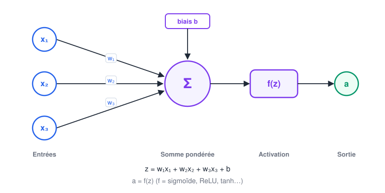
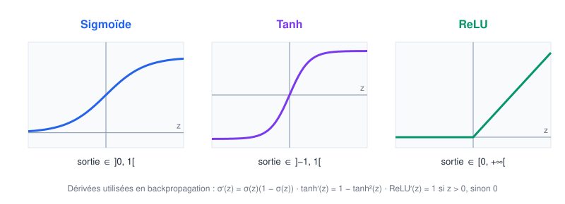
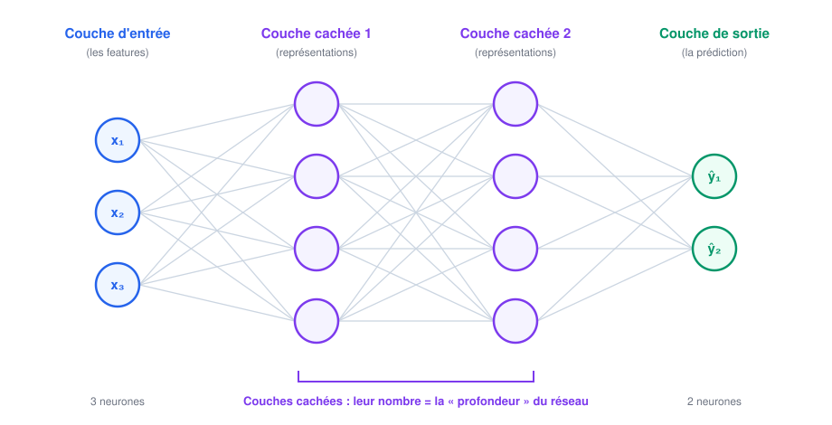
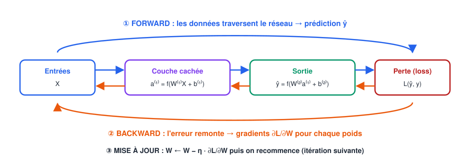
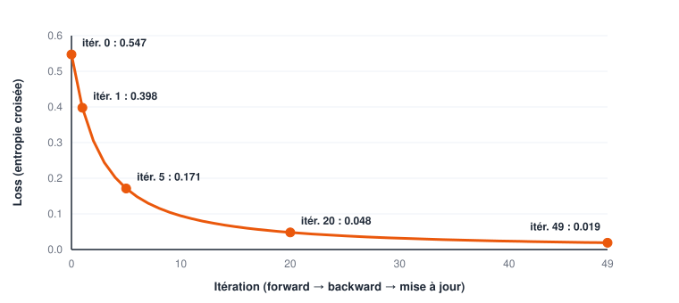
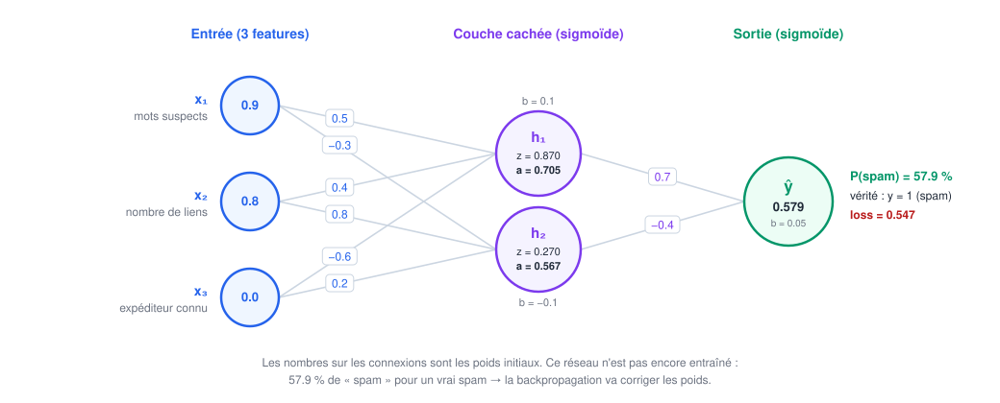

# 🔁 Forward et Backward Propagation — Cours Bootcamp Data Science

> **Module Data Science — Deep Learning** | Prérequis : cours "Fondamentaux IA/ML/DL" (`07-...md`), Checkpoint 9, notions de dérivées

---

## Table des matières

### Partie I — Comprendre les réseaux de neurones
1. [Qu'est-ce qu'un réseau de neurones ?](#1-quest-ce-quun-réseau-de-neurones-)
2. [Les composants d'un réseau de neurones](#2-les-composants-dun-réseau-de-neurones)
3. [L'apprentissage en trois étapes](#3-lapprentissage-en-trois-étapes)
4. [Pourquoi les réseaux de neurones sont importants](#4-pourquoi-les-réseaux-de-neurones-sont-importants)
5. [Les couches d'un réseau de neurones](#5-les-couches-dun-réseau-de-neurones)

### Partie II — Le fonctionnement : forward et backward
6. [Vue d'ensemble du fonctionnement](#6-vue-densemble-du-fonctionnement)
7. [Étape 1 — La propagation avant (Forward Propagation)](#7-étape-1--la-propagation-avant-forward-propagation)
8. [🧩 La fonction de perte (loss)](#8--la-fonction-de-perte-loss)
9. [Étape 2 — La rétropropagation (Backpropagation)](#9-étape-2--la-rétropropagation-backpropagation)
10. [Étape 3 — L'itération](#10-étape-3--litération)
11. [Exemple complet : classer un email (spam ou non)](#11-exemple-complet--classer-un-email-spam-ou-non)
12. [Implémentation from scratch en NumPy](#12-implémentation-from-scratch-en-numpy)

### Partie III — Comment un réseau apprend
13. [Apprentissage supervisé](#13-apprentissage-supervisé)
14. [Apprentissage non supervisé](#14-apprentissage-non-supervisé)
15. [Apprentissage par renforcement](#15-apprentissage-par-renforcement)
16. [🧩 Les pièges de l'entraînement et leurs remèdes](#16--les-pièges-de-lentraînement-et-leurs-remèdes)

### Partie IV — Panorama
17. [Les types de réseaux de neurones](#17-les-types-de-réseaux-de-neurones)
18. [Avantages des réseaux de neurones](#18-avantages-des-réseaux-de-neurones)
19. [Inconvénients des réseaux de neurones](#19-inconvénients-des-réseaux-de-neurones)
20. [Applications des réseaux de neurones](#20-applications-des-réseaux-de-neurones)

### Partie V — Synthèse
21. [Conclusion](#21-conclusion)
22. [✅ Point de contrôle — Forward & Backward Propagation](#22--point-de-contrôle--forward--backward-propagation)

> 🧩 = notion ajoutée au plan initial parce qu'elle est indispensable pour comprendre ou pratiquer.

---

# PARTIE I — COMPRENDRE LES RÉSEAUX DE NEURONES

## 1. Qu'est-ce qu'un réseau de neurones ?

### 📖 Définition

Un **réseau de neurones artificiels** (*Artificial Neural Network*, ANN) est un modèle de Machine Learning composé d'unités de calcul simples — les **neurones** — organisées en **couches** et reliées par des **connexions pondérées**. En ajustant ces poids à partir d'exemples, le réseau apprend à transformer une entrée (une image, un texte, des colonnes de données) en une sortie (une classe, un nombre, une probabilité).

> 💡 **Analogie de l'usine** : imaginez une chaîne de montage. Chaque poste (une couche) reçoit le travail du poste précédent, le transforme un peu, et le passe au suivant. Le premier poste reçoit la matière brute (les données), le dernier livre le produit fini (la prédiction). L'entraînement consiste à **régler chaque machine** (les poids) pour que le produit final soit correct.

### 1.1 Ce qu'un réseau de neurones n'est pas

| Idée reçue | Réalité |
|------------|---------|
| « C'est un cerveau artificiel » | C'est une fonction mathématique **inspirée** du cerveau, très simplifiée |
| « Il comprend ce qu'il fait » | Il ajuste des nombres pour **réduire une erreur**, sans compréhension |
| « C'est magique » | C'est de l'algèbre (produits matriciels) et du calcul différentiel (dérivées) |

> 🔑 **À retenir** : un réseau de neurones est une **fonction paramétrée** $\hat{y} = f(x; W, b)$. Apprendre, c'est trouver les paramètres $W$ et $b$ qui rendent $\hat{y}$ proche de la vraie réponse $y$. Ce cours explique **comment** : grâce à la *forward propagation* et à la *backpropagation*.

---

## 2. Les composants d'un réseau de neurones



*Figure 1 — Un neurone : il pondère ses entrées, ajoute un biais, puis applique une fonction d'activation.*

### 2.1 Les neurones

Le **neurone** est l'unité de calcul de base. Il reçoit plusieurs valeurs, les combine en un seul nombre, puis décide de « l'intensité » de son signal de sortie. Chaque neurone d'un réseau fait exactement le même type de calcul ; c'est **l'assemblage** de milliers de neurones qui produit des comportements complexes.

### 2.2 Les connexions

Les **connexions** relient les neurones d'une couche à ceux de la couche suivante. Elles transportent l'information dans **un seul sens** pendant la prédiction (de l'entrée vers la sortie). Dans un réseau **dense** (*fully connected*), chaque neurone est relié à **tous** les neurones de la couche suivante.

### 2.3 Les poids et les biais

| Paramètre | Rôle | Analogie |
|-----------|------|----------|
| **Poids $w$** | Importance d'une connexion : amplifie, atténue ou inverse un signal | le volume de chaque micro dans une table de mixage |
| **Biais $b$** | Décalage ajouté à la somme : rend le neurone plus ou moins facile à activer | le seuil de déclenchement d'une alarme |

> 🔑 **Les poids et les biais sont les seuls éléments appris.** Au départ, ils sont aléatoires ; l'entraînement les modifie progressivement. L'architecture (nombre de couches et de neurones), elle, est choisie par le data scientist : ce sont des **hyperparamètres**.

### 2.4 Les fonctions de propagation

Le calcul qui fait passer l'information d'un neurone à l'autre se décompose en deux fonctions :

**a) La fonction d'entrée (somme pondérée)** — combine les entrées :

$$z = \sum_{i=1}^{n} w_i x_i + b$$

**b) La fonction d'activation** — transforme $z$ en sortie :

$$a = f(z)$$



*Figure 2 — Les trois fonctions d'activation les plus utilisées, et leurs dérivées (indispensables à la backpropagation).*

| Activation | Formule | Usage typique |
|------------|---------|---------------|
| **Sigmoïde** | $\sigma(z) = \dfrac{1}{1+e^{-z}}$ | Sortie d'une classification **binaire** (probabilité) |
| **Tanh** | $\tanh(z)$ | Couches cachées (sortie centrée sur 0) |
| **ReLU** | $\max(0, z)$ | ⭐ Couches cachées par défaut (rapide, limite le gradient qui s'évanouit) |
| **Softmax** | $\dfrac{e^{z_k}}{\sum_j e^{z_j}}$ | Sortie **multiclasse** (probabilités qui somment à 1) |
| **Linéaire** | $z$ | Sortie d'une **régression** (valeur réelle quelconque) |

> ⚠️ **Pourquoi une activation non linéaire ?** Sans elle, empiler dix couches revient à une seule transformation linéaire : le réseau ne pourrait tracer que des frontières droites. La non-linéarité donne au réseau sa capacité à modéliser des relations complexes.

### 2.5 La règle d'apprentissage

La **règle d'apprentissage** dit **comment modifier les poids** pour réduire l'erreur. Dans les réseaux modernes, c'est la **descente de gradient** combinée à la **rétropropagation** :

$$w \leftarrow w - \eta \cdot \frac{\partial L}{\partial w}$$

- $L$ : la **perte** (*loss*), qui mesure l'erreur du réseau ;
- $\dfrac{\partial L}{\partial w}$ : le **gradient**, c'est-à-dire « dans quel sens et avec quelle force $L$ varie si on modifie $w$ » ;
- $\eta$ (êta) : le **taux d'apprentissage** (*learning rate*), la taille du pas.

> 💡 **Lecture de la formule** : si augmenter $w$ fait **augmenter** l'erreur (gradient positif), on **diminue** $w$ ; si augmenter $w$ fait **baisser** l'erreur (gradient négatif), on **augmente** $w$. On se déplace toujours dans la direction qui réduit l'erreur.

---

## 3. L'apprentissage en trois étapes

L'apprentissage d'un réseau suit un processus structuré, répété des milliers de fois :

```
┌──────────────────────────────────────────────────────────────────────┐
│ 1️⃣ CALCUL DES ENTRÉES (Input Computation)                            │
│    Les données x entrent dans le réseau. Chaque neurone calcule       │
│    sa somme pondérée z = Σ wᵢxᵢ + b.                                  │
├──────────────────────────────────────────────────────────────────────┤
│ 2️⃣ GÉNÉRATION DE LA SORTIE (Output Generation)                       │
│    Les activations a = f(z) se propagent de couche en couche          │
│    jusqu'à la prédiction finale ŷ.                                    │
├──────────────────────────────────────────────────────────────────────┤
│ 3️⃣ AFFINEMENT ITÉRATIF (Iterative Refinement)                        │
│    On compare ŷ à la vraie valeur y (loss), on calcule les gradients  │
│    (backpropagation) et on ajuste les poids (descente de gradient).   │
│    Puis on recommence avec de nouveaux exemples.                       │
└──────────────────────────────────────────────────────────────────────┘
```

| Étape | Nom technique | Question posée |
|-------|---------------|----------------|
| 1 + 2 | **Forward propagation** | « Que prédit le réseau avec ses poids actuels ? » |
| 3a | **Calcul de la loss** | « À quel point s'est-il trompé ? » |
| 3b | **Backpropagation** | « Quelle part de l'erreur revient à chaque poids ? » |
| 3c | **Mise à jour** | « Comment corriger chaque poids ? » |

---

## 4. Pourquoi les réseaux de neurones sont importants

1. **Ils apprennent leurs propres représentations.** Pas besoin de concevoir les features à la main : les premières couches d'un réseau de vision détectent seules des contours, les suivantes des formes, puis des objets.
2. **Ils modélisent des relations non linéaires complexes.** Le 🧩 **théorème d'approximation universelle** établit qu'un réseau avec une seule couche cachée suffisamment large peut approcher n'importe quelle fonction continue sur un domaine borné. En pratique, des réseaux **profonds** y parviennent avec beaucoup moins de neurones.
3. **Ils excellent sur les données non structurées** : images, son, texte, vidéo — là où le ML classique peine.
4. **Ils passent à l'échelle** : leurs performances continuent de progresser avec plus de données et de calcul.
5. **Ils sont au cœur de l'IA moderne** : reconnaissance vocale, traduction, voitures autonomes, grands modèles de langage (Claude, GPT…).

> ⚠️ **Nuance** : le théorème d'approximation universelle dit qu'une bonne solution **existe**, pas qu'on saura la **trouver** par entraînement, ni qu'elle **généralisera** à de nouvelles données. D'où l'importance des données, de l'architecture et de la régularisation.

---

## 5. Les couches d'un réseau de neurones



*Figure 3 — Un réseau dense « 3 → 4 → 4 → 2 » : une couche d'entrée, deux couches cachées, une couche de sortie. Chaque trait est un poids.*

### 5.1 Les trois types de couches

| Couche | Rôle | Nombre de neurones | Activation typique |
|--------|------|--------------------|--------------------|
| **Entrée** (*input layer*) | Reçoit les features ; ne calcule rien | = nombre de features | aucune |
| **Cachée(s)** (*hidden layers*) | Construit des représentations intermédiaires de plus en plus abstraites | choisi par le data scientist | ReLU (défaut) |
| **Sortie** (*output layer*) | Produit la prédiction | dépend de la tâche (voir ci-dessous) | sigmoïde / softmax / linéaire |

**Dimensionner la couche de sortie :**

| Tâche | Neurones de sortie | Activation | Loss |
|-------|--------------------|------------|------|
| Régression (un prix) | 1 | linéaire | MSE |
| Classification binaire (spam ?) | 1 | sigmoïde | entropie croisée binaire |
| Classification à K classes (chiffre 0–9) | K | softmax | entropie croisée catégorielle |

> 💡 **Pourquoi « cachées » ?** Parce qu'on ne voit jamais directement leurs valeurs dans les données : on fournit l'entrée, on observe la sortie, et les couches du milieu travaillent « en coulisses ».

### 5.2 🧩 Profondeur et largeur

- **Profondeur** = nombre de couches cachées. Un réseau avec plusieurs couches cachées est dit **profond** — d'où *Deep Learning*.
- **Largeur** = nombre de neurones dans une couche.

```
Réseau PEU PROFOND et LARGE      Réseau PROFOND et ÉTROIT
entrée → [64] → sortie           entrée → [16] → [16] → [16] → [16] → sortie
```

> 🔑 Les réseaux profonds apprennent des **hiérarchies** : chaque couche réutilise les représentations de la précédente. C'est souvent plus efficace qu'une seule couche très large.

### 5.3 🧩 Compter les paramètres d'un réseau

Entre une couche de $n$ neurones et une couche de $p$ neurones, il y a $n \times p$ poids et $p$ biais.

Pour le réseau de la Figure 3 (3 → 4 → 4 → 2) :

| Liaison | Poids | Biais | Total |
|---------|-------|-------|-------|
| Entrée (3) → Cachée 1 (4) | 3 × 4 = 12 | 4 | 16 |
| Cachée 1 (4) → Cachée 2 (4) | 4 × 4 = 16 | 4 | 20 |
| Cachée 2 (4) → Sortie (2) | 4 × 2 = 8 | 2 | 10 |
| **Total** | **36** | **10** | **46 paramètres** |

> 💡 Ce petit réseau a 46 paramètres. Un modèle de vision courant en a des dizaines de millions, un grand modèle de langage des centaines de milliards. Le principe reste identique : chaque paramètre est ajusté par backpropagation.

### 5.4 🧩 Notation utilisée dans ce cours

| Symbole | Signification |
|---------|---------------|
| $x$ | vecteur d'entrée (les features) |
| $W^{[l]}$, $b^{[l]}$ | poids et biais de la couche $l$ |
| $z^{[l]} = W^{[l]} a^{[l-1]} + b^{[l]}$ | somme pondérée de la couche $l$ |
| $a^{[l]} = f(z^{[l]})$ | activation (sortie) de la couche $l$, avec $a^{[0]} = x$ |
| $\hat{y} = a^{[L]}$ | prédiction (sortie de la dernière couche $L$) |
| $L(\hat{y}, y)$ | la perte (loss) |
| $\eta$ | le taux d'apprentissage |

---

# PARTIE II — LE FONCTIONNEMENT : FORWARD ET BACKWARD

## 6. Vue d'ensemble du fonctionnement



*Figure 4 — Le cycle complet : ① les données avancent jusqu'à la prédiction et à la loss, ② l'erreur remonte pour calculer les gradients, ③ les poids sont mis à jour.*

Le fonctionnement d'un réseau repose sur **trois mécanismes** enchaînés en boucle :

1. **Forward propagation** — calculer la prédiction ;
2. **Backpropagation** — calculer comment chaque poids a contribué à l'erreur ;
3. **Itération** — corriger les poids et recommencer.

---

## 7. Étape 1 — La propagation avant (Forward Propagation)

### 📖 Définition

La **propagation avant** fait circuler les données **de la couche d'entrée vers la couche de sortie**. À chaque couche, on applique la même recette : **somme pondérée, puis activation**. Le résultat de la dernière couche est la **prédiction** $\hat{y}$.

### 7.1 Les formules couche par couche

Pour un réseau à une couche cachée :

$$z^{[1]} = W^{[1]} x + b^{[1]} \qquad a^{[1]} = f^{[1]}\big(z^{[1]}\big)$$

$$z^{[2]} = W^{[2]} a^{[1]} + b^{[2]} \qquad \hat{y} = a^{[2]} = f^{[2]}\big(z^{[2]}\big)$$

Et en général, pour toute couche $l$ :

$$\boxed{\; z^{[l]} = W^{[l]} a^{[l-1]} + b^{[l]}, \qquad a^{[l]} = f^{[l]}\big(z^{[l]}\big) \;}$$

```
FORWARD PROPAGATION
x = a[0]  ──►  z[1] = W[1]·a[0] + b[1]  ──►  a[1] = f(z[1])
                                               │
          ┌────────────────────────────────────┘
          ▼
          z[2] = W[2]·a[1] + b[2]  ──►  ŷ = a[2] = f(z[2])  ──►  loss L(ŷ, y)

 →→→→→→→→→→→→→→→→ sens du calcul →→→→→→→→→→→→→→→→
```

### 7.2 🧩 Vérifier les dimensions

La forward propagation est une suite de **produits matriciels**. Une erreur de dimension est le bug numéro un ; vérifiez-les systématiquement. Pour un exemple $x$ (vecteur colonne) :

| Objet | Dimension | Pour le réseau 3 → 2 → 1 |
|-------|-----------|--------------------------|
| $x = a^{[0]}$ | $n^{[0]} \times 1$ | 3 × 1 |
| $W^{[1]}$ | $n^{[1]} \times n^{[0]}$ | 2 × 3 |
| $b^{[1]}$, $z^{[1]}$, $a^{[1]}$ | $n^{[1]} \times 1$ | 2 × 1 |
| $W^{[2]}$ | $n^{[2]} \times n^{[1]}$ | 1 × 2 |
| $\hat{y}$ | $n^{[2]} \times 1$ | 1 × 1 |

> 💡 **Convention en code** : en NumPy, on traite généralement **plusieurs exemples à la fois** en les empilant **en lignes** dans une matrice $X$ de forme $(m, n^{[0]})$. On écrit alors $Z = XW + b$ avec $W$ de forme $(n^{[0]}, n^{[1]})$ — c'est la convention de la section 12. Les deux écritures sont équivalentes (l'une est la transposée de l'autre).

### 7.3 Forward en NumPy

```python
import numpy as np

def sigmoid(z): return 1 / (1 + np.exp(-z))

x  = np.array([0.9, 0.8, 0.0])                      # 3 features
W1 = np.array([[ 0.5, 0.4, -0.6],
               [-0.3, 0.8,  0.2]])                   # (2, 3)
b1 = np.array([0.1, -0.1])
W2 = np.array([0.7, -0.4]);  b2 = 0.05

z1 = W1 @ x + b1;   a1 = sigmoid(z1)                 # couche cachée
z2 = W2 @ a1 + b2;  y_hat = sigmoid(z2)              # sortie
print(z1, a1, z2, y_hat)
# z1 = [0.87 0.27]  a1 = [0.7047 0.5671]  z2 = 0.3165  y_hat = 0.5785
```

> 🔑 **Pendant la forward, on mémorise les $z$ et les $a$ de chaque couche** : la backpropagation en aura besoin. C'est pour cela que l'entraînement consomme plus de mémoire que la simple prédiction.

---

## 8. 🧩 La fonction de perte (loss)

### 📖 Le juge de la prédiction

La **fonction de perte** transforme l'écart entre la prédiction $\hat{y}$ et la vérité $y$ en **un seul nombre** : plus il est grand, plus le réseau se trompe. Tout l'entraînement consiste à **minimiser** ce nombre.

| Tâche | Loss | Formule (un exemple) |
|-------|------|----------------------|
| Régression | **MSE** (erreur quadratique) | $L = (\hat{y} - y)^2$ |
| Classification binaire | **Entropie croisée binaire** | $L = -\big[y \log \hat{y} + (1-y)\log(1-\hat{y})\big]$ |
| Classification multiclasse | **Entropie croisée catégorielle** | $L = -\sum_k y_k \log \hat{y}_k$ |

Sur un jeu de $m$ exemples, on prend la **moyenne** des pertes individuelles (on parle alors de *fonction de coût* $J$).

> 💡 **Pourquoi l'entropie croisée en classification ?** Elle pénalise très fortement une prédiction **confiante et fausse** : prédire $\hat{y} = 0{,}01$ pour un vrai spam ($y=1$) coûte $-\ln(0{,}01) \approx 4{,}6$, alors que prédire $0{,}9$ ne coûte que $0{,}105$. De plus, combinée à une sortie sigmoïde, elle donne un gradient très simple (section 9.3).

> 🔗 Ce sont les mêmes notions que dans le cours **Métriques d'évaluation** (`04-...md`) : MSE pour la régression, *log loss* pour la classification.

---

## 9. Étape 2 — La rétropropagation (Backpropagation)

### 📖 Définition

La **rétropropagation** (*backpropagation*, ou *backprop*) calcule le **gradient de la loss par rapport à chaque poids et chaque biais** du réseau. Elle part de l'erreur en sortie et la fait **remonter couche par couche** jusqu'à l'entrée — dans le sens **inverse** de la forward.

> 💡 **Analogie de l'enquête** : une équipe rate un projet. Le chef de projet (couche de sortie) constate l'écart avec l'objectif. Il remonte la chaîne : quelle part du problème vient de chaque équipe (couches cachées), puis de chaque membre (poids) ? Chacun reçoit une « part de responsabilité » proportionnelle à son influence sur le résultat, et corrige son travail en conséquence.

### 9.1 L'outil mathématique : la règle de la chaîne

Un poids de la première couche n'influence pas la loss **directement** : il influence $z^{[1]}$, qui influence $a^{[1]}$, qui influence $z^{[2]}$, qui influence $\hat{y}$, qui influence $L$. La **règle de dérivation en chaîne** dit qu'on obtient le gradient en **multipliant les dérivées le long de ce chemin** :

$$\frac{\partial L}{\partial w^{[1]}} = \frac{\partial L}{\partial \hat{y}} \cdot \frac{\partial \hat{y}}{\partial z^{[2]}} \cdot \frac{\partial z^{[2]}}{\partial a^{[1]}} \cdot \frac{\partial a^{[1]}}{\partial z^{[1]}} \cdot \frac{\partial z^{[1]}}{\partial w^{[1]}}$$

```
CHEMIN DE L'INFLUENCE (forward)       CHEMIN DES DÉRIVÉES (backward)
w[1] → z[1] → a[1] → z[2] → ŷ → L     ∂L/∂w[1] ← ... ← ∂L/∂ŷ  (on multiplie)
```

### 9.2 Les formules de la backpropagation

On définit l'**erreur locale** d'une couche, $\delta^{[l]} = \dfrac{\partial L}{\partial z^{[l]}}$. La backprop se résume alors à quatre équations :

| # | Équation | Ce qu'elle calcule |
|---|----------|--------------------|
| 1 | $\delta^{[L]} = \dfrac{\partial L}{\partial \hat{y}} \odot f'^{[L]}\big(z^{[L]}\big)$ | l'erreur de la couche de sortie |
| 2 | $\delta^{[l]} = \big(W^{[l+1]}\big)^{\!\top} \delta^{[l+1]} \odot f'^{[l]}\big(z^{[l]}\big)$ | l'erreur d'une couche cachée, à partir de la suivante |
| 3 | $\dfrac{\partial L}{\partial W^{[l]}} = \delta^{[l]} \big(a^{[l-1]}\big)^{\!\top}$ | le gradient des poids |
| 4 | $\dfrac{\partial L}{\partial b^{[l]}} = \delta^{[l]}$ | le gradient des biais |

($\odot$ désigne la multiplication **élément par élément**.)

> 🔑 **Lecture de l'équation 3** : le gradient d'un poids = (l'erreur du neurone d'arrivée) × (l'activation du neurone de départ). Un poids qui relie un neurone **inactif** ($a = 0$) ne reçoit **aucune** correction : il n'a pas contribué à l'erreur.

### 9.3 Le cas sigmoïde + entropie croisée : $\delta = \hat{y} - y$

Pour une sortie sigmoïde et une entropie croisée binaire :

$$\frac{\partial L}{\partial \hat{y}} = -\frac{y}{\hat{y}} + \frac{1-y}{1-\hat{y}} \qquad \text{et} \qquad \frac{\partial \hat{y}}{\partial z} = \hat{y}(1-\hat{y})$$

En multipliant, presque tout se simplifie :

$$\boxed{\;\delta^{[L]} = \frac{\partial L}{\partial z^{[L]}} = \hat{y} - y\;}$$

> 💡 L'erreur de sortie est simplement **« prédiction − vérité »**. C'est l'une des raisons pour lesquelles le couple *sigmoïde + entropie croisée* (et son équivalent multiclasse *softmax + entropie croisée*) est le standard en classification.

### 9.4 🧩 Pourquoi la backpropagation est efficace

On pourrait estimer chaque gradient « à la main » en modifiant légèrement un poids et en refaisant une forward complète. Avec un million de poids, il faudrait un million de forwards **par itération**. La backpropagation obtient **tous** les gradients en **une seule passe arrière**, d'un coût comparable à celui d'une forward, en **réutilisant** les $\delta$ déjà calculés pour la couche suivante. C'est ce qui rend l'entraînement des grands réseaux possible.

> 💡 **Différentiation automatique** : en pratique, vous n'écrirez presque jamais ces formules. PyTorch et TensorFlow enregistrent les opérations de la forward dans un **graphe de calcul** et appliquent automatiquement la règle de la chaîne (`loss.backward()` en PyTorch). Comprendre la backprop reste indispensable pour diagnostiquer un entraînement qui échoue.

---

## 10. Étape 3 — L'itération

### 📖 Répéter jusqu'à convergence

Une seule correction ne suffit pas. On répète **forward → loss → backward → mise à jour** de nombreuses fois :

$$W^{[l]} \leftarrow W^{[l]} - \eta \, \frac{\partial L}{\partial W^{[l]}} \qquad b^{[l]} \leftarrow b^{[l]} - \eta \, \frac{\partial L}{\partial b^{[l]}}$$



*Figure 5 — La loss de l'exemple « email » (section 11) au fil de 50 itérations : 0,547 → 0,398 → 0,171 → 0,048 → 0,019. Chaque point correspond à un cycle forward + backward + mise à jour.*

### 10.1 Le vocabulaire de l'itération

| Terme | Définition |
|-------|------------|
| **Itération** | Une mise à jour des poids |
| **Batch (lot)** | Le groupe d'exemples utilisé pour calculer une mise à jour |
| **Epoch** | Un passage complet sur **tout** le jeu d'entraînement |
| **Learning rate $\eta$** | La taille du pas de mise à jour |
| **Convergence** | Le moment où la loss ne baisse plus de façon significative |

> 💡 Avec 10 000 exemples et des batchs de 100, une epoch = 100 itérations.

### 10.2 🧩 Les trois variantes de la descente de gradient

| Variante | Exemples par mise à jour | Avantages | Inconvénients |
|----------|--------------------------|-----------|---------------|
| **Batch** (complète) | tous | gradient exact, courbe lisse | lent et gourmand en mémoire sur gros jeux |
| **Stochastique (SGD)** | 1 | mises à jour très rapides | trajectoire bruitée |
| **Mini-batch** ⭐ | 32 à 512 en général | compromis vitesse / stabilité, exploite le GPU | un hyperparamètre de plus |

> 🔑 Quand on parle de « SGD » en Deep Learning, on désigne presque toujours la descente de gradient **par mini-batch**.

### 10.3 🧩 Le learning rate et les optimiseurs

```
η TROP GRAND                η ADAPTÉ                  η TROP PETIT
L │╲  ╱╲  ╱                 L │╲                       L │╲
  │ ╲╱  ╲╱  (oscille,         │ ╲                        │ ╲
  │        diverge)           │  ╲___                    │  ╲
  │                           │      ‾‾‾───             │   ╲ (descend
  └───────── itérations       └───────── itérations      └────╲── très lentement)
```

Des **optimiseurs** améliorent la mise à jour de base :

| Optimiseur | Idée |
|------------|------|
| **SGD** | la règle de base $w \leftarrow w - \eta \nabla$ |
| **Momentum** | garde une « vitesse » : accélère dans les directions constantes, amortit les oscillations |
| **RMSProp** | adapte le pas de chaque poids selon l'amplitude récente de ses gradients |
| **Adam** ⭐ | combine Momentum et RMSProp ; le choix par défaut le plus robuste |

---

## 11. Exemple complet : classer un email (spam ou non)

On déroule **à la main** un cycle complet sur un réseau minuscule. Tous les nombres ci-dessous ont été calculés et vérifiés en Python.

### 11.1 Le problème

On veut prédire si un email est un **spam** ($y = 1$) à partir de trois features normalisées entre 0 et 1 :

| Feature | Signification | Valeur pour notre email |
|---------|---------------|-------------------------|
| $x_1$ | proportion de mots suspects (« gratuit », « gagnant »…) | 0,9 |
| $x_2$ | nombre de liens (normalisé) | 0,8 |
| $x_3$ | expéditeur présent dans les contacts (1 = oui) | 0,0 |

Cet email **est** un spam : $y = 1$.

**Architecture** : 3 entrées → 2 neurones cachés (sigmoïde) → 1 sortie (sigmoïde). Loss : entropie croisée binaire. Taux d'apprentissage $\eta = 0{,}5$. Nombre de paramètres : $3 \times 2 + 2 + 2 \times 1 + 1 = 11$.



*Figure 6 — Le réseau avant entraînement, avec ses poids initiaux et le résultat de la forward propagation.*

### 11.2 Étape 1 — Forward propagation

**Couche cachée, neurone $h_1$** (poids $0{,}5$ ; $0{,}4$ ; $-0{,}6$ ; biais $0{,}1$) :

$$z_1 = 0{,}5 \times 0{,}9 + 0{,}4 \times 0{,}8 + (-0{,}6) \times 0 + 0{,}1 = 0{,}45 + 0{,}32 + 0 + 0{,}1 = 0{,}870$$

$$a_1 = \sigma(0{,}870) = 0{,}7047$$

**Couche cachée, neurone $h_2$** (poids $-0{,}3$ ; $0{,}8$ ; $0{,}2$ ; biais $-0{,}1$) :

$$z_2 = -0{,}27 + 0{,}64 + 0 - 0{,}1 = 0{,}270 \qquad a_2 = \sigma(0{,}270) = 0{,}5671$$

**Couche de sortie** (poids $0{,}7$ ; $-0{,}4$ ; biais $0{,}05$) :

$$z^{[2]} = 0{,}7 \times 0{,}7047 + (-0{,}4) \times 0{,}5671 + 0{,}05 = 0{,}4933 - 0{,}2268 + 0{,}05 = 0{,}3165$$

$$\hat{y} = \sigma(0{,}3165) = 0{,}5785$$

**Loss** :

$$L = -\ln(0{,}5785) = 0{,}5474$$

> 🧐 **Interprétation** : le réseau estime à **57,8 %** la probabilité de spam. Il penche du bon côté, mais sans conviction : la loss de 0,547 est élevée. La backpropagation va dire comment corriger chaque poids.

### 11.3 Étape 2 — Backpropagation

**Erreur de sortie** (cas sigmoïde + entropie croisée, section 9.3) :

$$\delta^{[2]} = \hat{y} - y = 0{,}5785 - 1 = -0{,}4215$$

**Gradients de la couche de sortie** (équations 3 et 4) :

| Paramètre | Calcul | Gradient |
|-----------|--------|----------|
| $w^{[2]}_1$ (depuis $h_1$) | $\delta^{[2]} \times a_1 = -0{,}4215 \times 0{,}7047$ | $-0{,}2971$ |
| $w^{[2]}_2$ (depuis $h_2$) | $\delta^{[2]} \times a_2 = -0{,}4215 \times 0{,}5671$ | $-0{,}2390$ |
| $b^{[2]}$ | $\delta^{[2]}$ | $-0{,}4215$ |

**Erreurs des neurones cachés** (équation 2, avec $\sigma'(z) = a(1-a)$) :

$$\delta_1 = \delta^{[2]} \times w^{[2]}_1 \times a_1(1-a_1) = -0{,}4215 \times 0{,}7 \times 0{,}2081 = -0{,}0614$$

$$\delta_2 = \delta^{[2]} \times w^{[2]}_2 \times a_2(1-a_2) = -0{,}4215 \times (-0{,}4) \times 0{,}2455 = +0{,}0414$$

**Gradients de la couche cachée** ($\delta_j \times x_i$) :

| | depuis $x_1 = 0{,}9$ | depuis $x_2 = 0{,}8$ | depuis $x_3 = 0$ | biais |
|---|---|---|---|---|
| vers $h_1$ ($\delta_1 = -0{,}0614$) | $-0{,}0553$ | $-0{,}0491$ | $0$ | $-0{,}0614$ |
| vers $h_2$ ($\delta_2 = +0{,}0414$) | $+0{,}0373$ | $+0{,}0331$ | $0$ | $+0{,}0414$ |

> 🔑 **Observation clé** : les poids partant de $x_3$ ont un gradient **nul**. Comme $x_3 = 0$, ces connexions n'ont rien transmis : elles ne sont donc pas « responsables » de l'erreur et ne sont pas modifiées par cet exemple.

### 11.4 Étape 3 — Mise à jour des poids ($\eta = 0{,}5$)

$$w \leftarrow w - 0{,}5 \times \frac{\partial L}{\partial w}$$

| Paramètre | Avant | Gradient | Après | Effet |
|-----------|-------|----------|-------|-------|
| $w^{[2]}_1$ | 0,7000 | −0,2971 | **0,8485** | $h_1$ pousse davantage vers « spam » |
| $w^{[2]}_2$ | −0,4000 | −0,2390 | **−0,2805** | $h_2$ freine moins |
| $b^{[2]}$ | 0,0500 | −0,4215 | **0,2608** | la sortie monte |
| $W^{[1]}$, ligne $h_1$ | 0,5 / 0,4 / −0,6 | −0,0553 / −0,0491 / 0 | **0,5276 / 0,4246 / −0,6** | $h_1$ devient plus sensible aux mots suspects et aux liens |
| $W^{[1]}$, ligne $h_2$ | −0,3 / 0,8 / 0,2 | +0,0373 / +0,0331 / 0 | **−0,3186 / 0,7834 / 0,2** | $h_2$ (qui freine la sortie) s'active moins |
| $b^{[1]}$ | 0,1 / −0,1 | −0,0614 / +0,0414 | **0,1307 / −0,1207** | |

### 11.5 Résultat : le réseau s'est amélioré

En refaisant une forward avec les nouveaux poids :

| | Avant | Après 1 itération | Après 50 itérations |
|---|---|---|---|
| Probabilité de spam $\hat{y}$ | 57,8 % | **67,2 %** | **98,2 %** |
| Loss | 0,547 | **0,398** | **0,019** |

> 🔑 **Toute la logique du Deep Learning est là** : une forward pour prédire, une backward pour attribuer l'erreur à chaque poids, une petite correction dans le bon sens — et on recommence. Les réseaux géants font exactement cela, sur des milliards de poids et d'exemples.

> ⚠️ **Limite de l'exemple** : on a entraîné le réseau sur **un seul** email. Il a appris à reconnaître *cet* email, pas les spams en général. En pratique, on entraîne sur des milliers d'emails et on évalue sur un jeu de test séparé (cours *Train/Test Split*).

---

## 12. Implémentation from scratch en NumPy

On assemble tout dans un vrai réseau (2 entrées → 16 neurones ReLU → 1 sortie sigmoïde), entraîné sur le jeu `make_moons` : deux nuages de points en forme de lunes imbriquées, impossibles à séparer par une droite.

```python
import numpy as np
from sklearn.datasets import make_moons
from sklearn.model_selection import train_test_split

# --- Données non linéairement séparables ---
X, y = make_moons(n_samples=1000, noise=0.2, random_state=42)
X_tr, X_te, y_tr, y_te = train_test_split(X, y, test_size=0.2,
                                          random_state=42, stratify=y)
y_tr, y_te = y_tr.reshape(-1, 1), y_te.reshape(-1, 1)

def sigmoid(z): return 1 / (1 + np.exp(-z))
def relu(z):    return np.maximum(0, z)

# --- Initialisation (He, adaptée à ReLU) ---
rng = np.random.default_rng(42)
n_in, n_h, n_out = 2, 16, 1
W1 = rng.normal(0, np.sqrt(2 / n_in), (n_in, n_h));  b1 = np.zeros((1, n_h))
W2 = rng.normal(0, np.sqrt(2 / n_h), (n_h, n_out));  b2 = np.zeros((1, n_out))

def forward(X, W1, b1, W2, b2):
    Z1 = X @ W1 + b1;   A1 = relu(Z1)        # couche cachée
    Z2 = A1 @ W2 + b2;  A2 = sigmoid(Z2)     # sortie
    return Z1, A1, Z2, A2                    # on garde tout pour la backward

def loss_fn(A2, y):
    eps = 1e-12                              # évite log(0)
    return -np.mean(y * np.log(A2 + eps) + (1 - y) * np.log(1 - A2 + eps))

def backward(X, y, Z1, A1, A2, W2):
    m = X.shape[0]
    dZ2 = (A2 - y) / m                       # δ sortie = ŷ - y (moyenné)
    dW2 = A1.T @ dZ2;  db2 = dZ2.sum(axis=0, keepdims=True)
    dA1 = dZ2 @ W2.T                         # l'erreur remonte
    dZ1 = dA1 * (Z1 > 0)                     # dérivée de ReLU
    dW1 = X.T @ dZ1;   db1 = dZ1.sum(axis=0, keepdims=True)
    return dW1, db1, dW2, db2

# --- Boucle d'entraînement ---
eta = 0.5
for epoch in range(1, 2001):
    Z1, A1, Z2, A2 = forward(X_tr, W1, b1, W2, b2)          # 1. forward
    dW1, db1, dW2, db2 = backward(X_tr, y_tr, Z1, A1, A2, W2)  # 2. backward
    W1 -= eta * dW1;  b1 -= eta * db1                       # 3. mise à jour
    W2 -= eta * dW2;  b2 -= eta * db2
    if epoch in (1, 100, 500, 1000, 2000):
        print(f"epoch {epoch:4d} | loss = {loss_fn(A2, y_tr):.4f}")

acc = ((forward(X_te, W1, b1, W2, b2)[3] > 0.5) == y_te).mean()
print(f"Accuracy test : {acc:.3f}")
```

```
epoch    1 | loss = 0.6735
epoch  100 | loss = 0.2760
epoch  500 | loss = 0.2506
epoch 1000 | loss = 0.1134
epoch 2000 | loss = 0.0803
Accuracy test : 0.975
```

> 💡 La loss stagne autour de 0,25 entre les epochs 100 et 500, puis rechute : le réseau traverse un **plateau** avant de trouver comment courber sa frontière autour des lunes. C'est fréquent ; arrêter trop tôt aurait donné un modèle médiocre.

| Objet (code) | Forme | Signification |
|--------------|-------|---------------|
| `X_tr` | (800, 2) | 800 exemples, 2 features |
| `W1`, `Z1`, `A1` | (2, 16) / (800, 16) / (800, 16) | couche cachée de 16 neurones |
| `W2`, `A2` | (16, 1) / (800, 1) | une probabilité par exemple |

### 12.1 🧩 Vérifier sa backpropagation : le *gradient checking*

Une backprop codée à la main peut contenir une erreur silencieuse : le réseau apprend mal, sans message d'erreur. On la vérifie en comparant un gradient **analytique** (backprop) à une approximation **numérique** :

$$\frac{\partial L}{\partial w} \approx \frac{L(w + \varepsilon) - L(w - \varepsilon)}{2\varepsilon} \qquad (\varepsilon \approx 10^{-6})$$

```python
Z1, A1, Z2, A2 = forward(X_tr, W1, b1, W2, b2)
dW1, *_ = backward(X_tr, y_tr, Z1, A1, A2, W2)

eps, i, j = 1e-6, 0, 3
W1p, W1m = W1.copy(), W1.copy()
W1p[i, j] += eps;  W1m[i, j] -= eps
num = (loss_fn(forward(X_tr, W1p, b1, W2, b2)[3], y_tr)
       - loss_fn(forward(X_tr, W1m, b1, W2, b2)[3], y_tr)) / (2 * eps)
ecart = abs(num - dW1[i, j]) / (abs(num) + abs(dW1[i, j]))
print(f"analytique {dW1[i, j]:.8f} | numérique {num:.8f} | écart {ecart:.1e}")
# Sur les poids initiaux : analytique -0.02069953 | numérique -0.02069953 | écart 9.2e-10
```

> 🔑 Un écart relatif inférieur à $10^{-7}$ indique une backprop correcte. Au-delà de $10^{-3}$, il y a presque sûrement un bug. On ne fait cette vérification qu'en phase de mise au point : elle est bien trop lente pour l'entraînement.

### 12.2 La même chose en une ligne avec scikit-learn

```python
from sklearn.neural_network import MLPClassifier
mlp = MLPClassifier(hidden_layer_sizes=(16,), activation="relu",
                    solver="adam", max_iter=2000, random_state=42)
mlp.fit(X_tr, y_tr.ravel())     # forward + backprop + Adam, en interne
```

> 💡 `MLPClassifier`, Keras et PyTorch exécutent exactement les étapes codées ci-dessus. Les avoir écrites une fois permet de comprendre ce qui se passe quand on appelle `fit()`.

---

# PARTIE III — COMMENT UN RÉSEAU APPREND

La mécanique **forward → loss → backward → mise à jour** est toujours la même. Ce qui change d'un paradigme à l'autre, c'est **d'où vient le signal d'erreur**.

```
                 D'OÙ VIENT LE SIGNAL QUI DÉFINIT LA LOSS ?
SUPERVISÉ       → de l'étiquette y fournie par un humain
NON SUPERVISÉ   → des données elles-mêmes (ex. : savoir les reconstruire)
RENFORCEMENT    → d'une récompense donnée par l'environnement
```

## 13. Apprentissage supervisé

### 📖 Principe

Chaque exemple d'entraînement est accompagné de la **bonne réponse** $y$. La loss compare la prédiction $\hat{y}$ à $y$, et la backprop corrige les poids pour réduire cet écart. C'est le cas de l'exemple « email » et de l'immense majorité des applications.

| Tâche | Entrée | Étiquette $y$ | Loss |
|-------|--------|---------------|------|
| Détection de spam | email | spam / non spam | entropie croisée binaire |
| Reconnaissance de chiffres | image 28×28 | 0 à 9 | entropie croisée catégorielle |
| Prix d'un logement | surface, quartier… | prix | MSE |

> ⚠️ **Coût caché** : l'apprentissage supervisé exige des données **étiquetées**, souvent longues et chères à produire (annotation manuelle d'images, de diagnostics médicaux…).

## 14. Apprentissage non supervisé

### 📖 Principe

Il n'y a **pas d'étiquette**. Le réseau apprend la **structure** des données. Pour pouvoir utiliser la backprop, on construit une loss à partir des données elles-mêmes.

**Exemple phare : l'autoencodeur.** Le réseau compresse l'entrée en une petite représentation (le **goulot**), puis tente de la **reconstruire**. La loss est l'**erreur de reconstruction** $L = \lVert x - \hat{x} \rVert^2$ : la « bonne réponse », c'est l'entrée elle-même.

```
AUTOENCODEUR
x (784 pixels) → [encodeur] → code (32 valeurs) → [décodeur] → x̂ (784 pixels)
                                                       loss = ‖x − x̂‖²
```

| Usage | Comment |
|-------|---------|
| Réduction de dimension | on garde le code compressé (une alternative non linéaire à la PCA) |
| Détection d'anomalies | une transaction mal reconstruite est inhabituelle → suspecte |
| Débruitage | on apprend à reconstruire une image propre à partir d'une image bruitée |

> 💡 Les cartes auto-organisatrices (*Self-Organizing Maps*) et le pré-entraînement des grands modèles de langage (prédire le mot suivant d'un texte, une étiquette « gratuite » tirée des données) relèvent de cette famille ; on parle aussi d'**apprentissage auto-supervisé**.

## 15. Apprentissage par renforcement

### 📖 Principe

Un **agent** agit dans un **environnement** et reçoit des **récompenses** (positives ou négatives). Il n'y a pas de bonne réponse pour chaque action, seulement un score qui arrive parfois longtemps après. Le réseau de neurones sert de **cerveau** de l'agent : il prend en entrée l'état de l'environnement et produit une action (ou la valeur estimée de chaque action).

```
        ┌────────── état sₜ, récompense rₜ ──────────┐
        ▼                                             │
   🤖 AGENT (réseau de neurones) ── action aₜ ──►  🌍 ENVIRONNEMENT
```

La loss est construite à partir des récompenses : par exemple, dans le *Deep Q-Learning*, le réseau prédit la valeur d'une action et on réduit l'écart entre cette prédiction et « la récompense obtenue + la valeur estimée de la suite ». La backprop fonctionne ensuite exactement comme d'habitude.

| Application | État | Actions | Récompense |
|-------------|------|---------|------------|
| Jeux (AlphaGo, Atari) | plateau / écran | coups possibles | victoire / score |
| Robotique | capteurs | mouvements des moteurs | tâche réussie |
| Gestion d'énergie | consommation, météo | réglages | économies réalisées |

### 15.1 Comparaison des trois paradigmes

| | Supervisé | Non supervisé | Renforcement |
|---|---|---|---|
| **Signal** | étiquette $y$ | les données elles-mêmes | récompense |
| **Loss typique** | entropie croisée, MSE | erreur de reconstruction | erreur sur la valeur des actions |
| **Exemple** | classer des emails | détecter des fraudes inhabituelles | apprendre à jouer |
| **Difficulté principale** | coût de l'étiquetage | évaluer la qualité du résultat | récompenses rares et tardives |

---

## 16. 🧩 Les pièges de l'entraînement et leurs remèdes

### 16.1 L'initialisation des poids

> ⚠️ **Ne jamais initialiser tous les poids à zéro.** Tous les neurones d'une couche calculeraient alors la même chose, recevraient le même gradient et resteraient identiques pour toujours : c'est le **problème de symétrie**. On initialise donc **aléatoirement**, avec une échelle adaptée :

| Méthode | Écart-type des poids | Pour |
|---------|----------------------|------|
| **Xavier / Glorot** | $\sqrt{1/n_{\text{entrées}}}$ (variante courante) | sigmoïde, tanh |
| **He** | $\sqrt{2/n_{\text{entrées}}}$ | ReLU (utilisée en section 12) |

### 16.2 Le gradient qui s'évanouit ou qui explose

La backprop **multiplie** des dérivées, couche après couche.

- **Gradient qui s'évanouit** (*vanishing gradient*) : la dérivée de la sigmoïde vaut au plus 0,25. Sur 10 couches, $0{,}25^{10} \approx 10^{-6}$ : les premières couches ne reçoivent presque plus de signal et n'apprennent plus.
- **Gradient qui explose** (*exploding gradient*) : à l'inverse, des facteurs supérieurs à 1 font grossir le gradient jusqu'à des valeurs démesurées (la loss devient `nan`).

| Remède | Effet |
|--------|-------|
| **ReLU** dans les couches cachées | dérivée égale à 1 pour $z > 0$ : le signal ne s'atténue pas |
| **Bonne initialisation** (He, Xavier) | garde des activations d'amplitude stable |
| **Batch normalization** | renormalise les activations entre les couches |
| **Connexions résiduelles** (ResNet) | offrent un « raccourci » au gradient |
| **Gradient clipping** | plafonne la norme du gradient (contre l'explosion) |
| **LSTM / GRU** | conçus pour limiter l'évanouissement dans les réseaux récurrents |

### 16.3 Le surapprentissage (overfitting)

Un réseau a souvent assez de paramètres pour **mémoriser** son jeu d'entraînement. On le détecte en surveillant la loss sur un jeu de **validation** : elle remonte alors que la loss d'entraînement continue de baisser.

| Remède | Principe |
|--------|----------|
| **Plus de données** / augmentation de données | plus difficile à mémoriser |
| **Régularisation L2** (*weight decay*) | pénalise les grands poids dans la loss |
| **Dropout** | désactive aléatoirement des neurones pendant l'entraînement |
| **Early stopping** | arrête l'entraînement quand la loss de validation remonte |
| **Réseau plus petit** | moins de capacité à mémoriser |

> 🔗 C'est le même compromis biais / variance que dans le cours *Train/Test Split et Validation Croisée* (`03-...md`).

### 16.4 Ne pas oublier la mise à l'échelle des données

La descente de gradient est très sensible à l'échelle des features : standardisez toujours les entrées (`StandardScaler`, ajusté sur le train uniquement — cours `05-...md`).

---

# PARTIE IV — PANORAMA

## 17. Les types de réseaux de neurones

| Type | Structure | Spécialité | Exemples d'applications |
|------|-----------|------------|-------------------------|
| **Perceptron** | un seul neurone | séparation linéaire (historique, 1958) | portes logiques, pédagogie |
| **Perceptron multicouche (MLP)** / *Feedforward* | couches denses, information à sens unique | données tabulaires | scoring de crédit, détection de spam |
| **CNN** (convolutif) | filtres qui balaient l'image | 🖼️ images, motifs locaux | diagnostic médical, reconnaissance faciale |
| **RNN** (récurrent) | boucle qui conserve une mémoire | 🔤 séquences | séries temporelles, texte (historique) |
| **LSTM / GRU** | RNN avec « portes » de mémoire | séquences longues | prévision de ventes, reconnaissance vocale |
| **Transformer** | mécanisme d'**attention** | 🔤 langage, puis vision et audio | traduction, Claude, GPT |
| **Autoencodeur** | encodeur + décodeur | compression, anomalies | détection de fraude, débruitage |
| **GAN** | un générateur contre un discriminateur | génération d'images réalistes | création d'images, augmentation de données |
| **GNN** (graphes) | messages échangés entre nœuds | données en réseau | réseaux sociaux, molécules |

> 🔑 **Tous ces réseaux s'entraînent de la même façon** : forward, loss, backpropagation, mise à jour. Seule la manière dont les neurones sont connectés change.

---

## 18. Avantages des réseaux de neurones

| Avantage | Explication |
|----------|-------------|
| **Apprentissage automatique des features** | pas besoin d'ingénierie manuelle des variables |
| **Relations non linéaires complexes** | modélisent ce que les modèles linéaires ne peuvent pas |
| **Polyvalence** | une même mécanique pour l'image, le son, le texte, les tableaux |
| **Passage à l'échelle** | les performances progressent avec les données et le calcul |
| **Tolérance au bruit** | une connaissance répartie sur de nombreux poids résiste aux données imparfaites |
| **Apprentissage par transfert** | un modèle pré-entraîné peut être adapté à une nouvelle tâche avec peu de données |
| **Traitement parallèle** | les produits matriciels s'exécutent très vite sur GPU |

---

## 19. Inconvénients des réseaux de neurones

| Inconvénient | Explication |
|--------------|-------------|
| **Besoin de beaucoup de données** | sur peu d'exemples, ils surapprennent |
| **Coût de calcul et énergétique** | entraînement long, GPU souvent nécessaires |
| **Boîte noire** | difficile d'expliquer une décision (problème en crédit, santé, justice) |
| **Nombreux hyperparamètres** | architecture, learning rate, batch, régularisation… beaucoup d'essais |
| **Entraînement délicat** | plateaux, gradients qui s'évanouissent ou explosent, minima locaux |
| **Reproduction des biais** | ils apprennent les biais présents dans les données |
| **Souvent battus sur les données tabulaires** | le *Gradient Boosting* reste fréquemment meilleur et plus simple |

> 🔑 **Règle pratique** : sur un tableau de quelques milliers de lignes, commencez par un modèle classique (régression logistique, Random Forest, Gradient Boosting). Réservez les réseaux de neurones aux données volumineuses ou non structurées.

---

## 20. Applications des réseaux de neurones

| Domaine | Applications |
|---------|--------------|
| **Vision par ordinateur** | reconnaissance faciale, lecture de plaques, contrôle qualité industriel, détection de maladies des cultures à partir de photos de feuilles |
| **Langage (NLP)** | traduction automatique, assistants conversationnels, analyse de sentiment, résumé de documents |
| **Audio** | reconnaissance vocale, transcription, synthèse vocale |
| **Santé** | analyse de radiographies, aide au diagnostic, découverte de médicaments |
| **Finance** | détection de fraude (cartes, Mobile Money), scoring de crédit, prévision de séries financières |
| **Transport** | véhicules autonomes, optimisation d'itinéraires, prévision du trafic |
| **Commerce** | systèmes de recommandation, prévision de la demande, tarification |
| **Création** | génération d'images, de musique, de code |

---

# PARTIE V — SYNTHÈSE

## 21. Conclusion

### 🎓 Ce qu'il faut absolument retenir

1. **Un réseau de neurones est une fonction paramétrée** : des couches de neurones qui calculent chacun une somme pondérée suivie d'une activation non linéaire. Les **poids et les biais** sont les seuls éléments appris.

2. **La forward propagation** fait avancer les données couche par couche — $z = Wa + b$, puis $a = f(z)$ — jusqu'à la prédiction $\hat{y}$.

3. **La loss** mesure l'erreur en un seul nombre : MSE en régression, entropie croisée en classification.

4. **La backpropagation** remonte l'erreur de la sortie vers l'entrée grâce à la **règle de la chaîne** et calcule le gradient de **tous** les paramètres en une seule passe. Pour une sortie sigmoïde avec entropie croisée, l'erreur de sortie vaut simplement $\hat{y} - y$.

5. **La descente de gradient** corrige chaque paramètre dans le sens qui réduit l'erreur : $w \leftarrow w - \eta \, \partial L / \partial w$. On répète ce cycle sur de nombreuses itérations et epochs, en général par **mini-batchs** et avec l'optimiseur **Adam**.

6. **L'exemple de l'email** l'a montré concrètement : en une itération, la probabilité de spam passe de 57,8 % à 67,2 % et la loss de 0,547 à 0,398 ; un poids relié à une entrée nulle ne reçoit aucune correction.

7. **Le paradigme change la source du signal**, pas la mécanique : étiquettes (supervisé), données elles-mêmes (non supervisé), récompenses (renforcement).

8. **Entraîner, c'est aussi éviter les pièges** : bonne initialisation, ReLU contre le gradient qui s'évanouit, régularisation et early stopping contre le surapprentissage, données standardisées.

### 🧭 Le mémo en une image

```
┌───────────────────────────────────────────────────────────────────────┐
│  FORWARD   z[l] = W[l]·a[l-1] + b[l]     a[l] = f(z[l])     → ŷ        │
│  LOSS      L(ŷ, y)   (MSE · entropie croisée)                          │
│  BACKWARD  δ[L] = ŷ − y   (sigmoïde/softmax + entropie croisée)       │
│            δ[l] = (W[l+1])ᵀ·δ[l+1] ⊙ f′(z[l])                          │
│            ∂L/∂W[l] = δ[l]·(a[l-1])ᵀ        ∂L/∂b[l] = δ[l]            │
│  UPDATE    W ← W − η·∂L/∂W      (mini-batch, Adam)                     │
│  RÉPÉTER   jusqu'à ce que la loss de VALIDATION cesse de baisser       │
└───────────────────────────────────────────────────────────────────────┘
```

> 🔑 **En une phrase** : *la forward propagation pose une question, la loss mesure l'erreur de la réponse, et la backpropagation indique à chaque poids comment se corriger — répété des milliers de fois, ce dialogue est tout l'apprentissage d'un réseau de neurones.*

---

## 22. ✅ Point de contrôle — Forward & Backward Propagation

### 🧠 Questions de compréhension

<details>
<summary><b>1. Que sont, concrètement, les paramètres appris par un réseau de neurones ?</b></summary>

Les **poids** $W$ de chaque connexion et les **biais** $b$ de chaque neurone. L'architecture (nombre de couches, de neurones, choix des activations) et le learning rate sont des **hyperparamètres** choisis par le data scientist.
</details>

<details>
<summary><b>2. Combien de paramètres a un réseau dense 4 → 8 → 3 ?</b></summary>

Entrée → cachée : $4 \times 8 + 8 = 40$. Cachée → sortie : $8 \times 3 + 3 = 27$. **Total : 67 paramètres.**
</details>

<details>
<summary><b>3. Décrivez la forward propagation en une phrase et donnez sa formule générale.</b></summary>

Les données traversent le réseau de l'entrée vers la sortie ; chaque couche calcule une somme pondérée puis applique une activation : $z^{[l]} = W^{[l]} a^{[l-1]} + b^{[l]}$ et $a^{[l]} = f(z^{[l]})$.
</details>

<details>
<summary><b>4. Pourquoi mémorise-t-on les valeurs z et a pendant la forward ?</b></summary>

Parce que la backpropagation en a besoin : les gradients des poids utilisent les activations $a^{[l-1]}$, et les dérivées des activations utilisent les $z^{[l]}$. Les recalculer coûterait une forward supplémentaire.
</details>

<details>
<summary><b>5. Quel outil mathématique permet la backpropagation, et que fait-il ?</b></summary>

La **règle de dérivation en chaîne** : le gradient d'un poids s'obtient en multipliant les dérivées le long du chemin qui relie ce poids à la loss. La backprop applique cette règle de la sortie vers l'entrée en réutilisant les calculs déjà faits.
</details>

<details>
<summary><b>6. Pour une sortie sigmoïde avec entropie croisée, que vaut l'erreur de sortie δ ? Vérifiez sur l'exemple de l'email.</b></summary>

$\delta = \hat{y} - y$. Dans l'exemple : $0{,}5785 - 1 = -0{,}4215$. Le signe négatif indique qu'il faut **augmenter** la sortie : la mise à jour $w \leftarrow w - \eta \delta a$ fait monter les poids reliés à des neurones actifs.
</details>

<details>
<summary><b>7. Dans l'exemple de l'email, pourquoi les poids partant de x₃ ne changent-ils pas ?</b></summary>

Parce que $x_3 = 0$ : le gradient d'un poids est $\delta \times$ (activation de départ) $= \delta \times 0 = 0$. Ces connexions n'ont rien transmis lors de la forward ; elles ne sont pas responsables de l'erreur.
</details>

<details>
<summary><b>8. Quelle est la différence entre une itération et une epoch ?</b></summary>

Une **itération** est une mise à jour des poids (sur un batch). Une **epoch** est un passage complet sur tout le jeu d'entraînement. Avec 10 000 exemples et des batchs de 100, une epoch compte 100 itérations.
</details>

<details>
<summary><b>9. Que se passe-t-il si le learning rate est trop grand ? trop petit ?</b></summary>

Trop **grand** : les mises à jour dépassent le minimum, la loss oscille ou diverge (jusqu'à `nan`). Trop **petit** : la loss baisse très lentement et l'entraînement peut sembler bloqué.
</details>

<details>
<summary><b>10. Pourquoi ne faut-il pas initialiser tous les poids à zéro ?</b></summary>

Tous les neurones d'une couche calculeraient la même sortie et recevraient le même gradient : ils resteraient identiques pour toujours (problème de **symétrie**). Le réseau se comporterait comme s'il n'avait qu'un neurone par couche.
</details>

<details>
<summary><b>11. Qu'est-ce que le gradient qui s'évanouit et comment le limiter ?</b></summary>

Dans un réseau profond, la backprop multiplie de nombreuses dérivées inférieures à 1 (au plus 0,25 pour la sigmoïde) : le gradient devient minuscule dans les premières couches, qui n'apprennent plus. On le limite avec **ReLU**, une bonne **initialisation** (He/Xavier), la **batch normalization** ou des **connexions résiduelles**.
</details>

<details>
<summary><b>12. À quoi sert le gradient checking ?</b></summary>

À vérifier qu'une backpropagation codée à la main est correcte, en comparant le gradient analytique à une approximation numérique $\frac{L(w+\varepsilon) - L(w-\varepsilon)}{2\varepsilon}$. Un écart relatif inférieur à $10^{-7}$ indique une implémentation correcte.
</details>

<details>
<summary><b>13. Qu'est-ce qui distingue l'apprentissage supervisé, non supervisé et par renforcement du point de vue de la loss ?</b></summary>

La mécanique (forward, backprop, mise à jour) est identique ; seule la **source du signal** change : l'étiquette $y$ (supervisé), les données elles-mêmes, par exemple l'erreur de reconstruction d'un autoencodeur (non supervisé), ou une récompense de l'environnement (renforcement).
</details>

<details>
<summary><b>14. Associez chaque type de réseau à une donnée : CNN, LSTM, Transformer, autoencodeur.</b></summary>

**CNN** → images. **LSTM** → séquences et séries temporelles. **Transformer** → texte et langage (et de plus en plus la vision). **Autoencodeur** → compression et détection d'anomalies.
</details>

### 🛠️ Exercices pratiques

1. **À la main** : reprenez l'exemple de l'email avec un email **légitime** ($x = [0{,}1 ;\ 0{,}2 ;\ 1{,}0]$, $y = 0$) et les mêmes poids initiaux. Calculez $\hat{y}$, la loss, $\delta^{[2]}$ et le nouveau $w^{[2]}_1$ après une mise à jour. Le poids partant de $x_3$ change-t-il cette fois ? Pourquoi ?
2. **En NumPy** : dans le code de la section 12, remplacez ReLU par la sigmoïde dans la couche cachée (dérivée `A1 * (1 - A1)`). Comparez la vitesse de descente de la loss et l'accuracy finale. Lancez le gradient checking pour valider votre modification.
3. **Learning rate** : entraînez le réseau de la section 12 avec $\eta \in \{0{,}01 ;\ 0{,}5 ;\ 5\}$ et tracez les trois courbes de loss sur un même graphique. Décrivez chaque comportement.
4. **Surapprentissage** : passez la couche cachée à 256 neurones, réduisez le jeu d'entraînement à 100 exemples, et tracez les loss d'entraînement et de test au fil des epochs. Repérez le moment où le modèle commence à surapprendre.

> 🔗 **Pour aller plus loin** : le Checkpoint 9 (`08-...md`) entraîne un `MLPClassifier` sur un jeu de données réel ; reprenez-le en vous demandant, à chaque étape, ce que font la forward et la backward.

---

*📘 Module Data Science — Forward et Backward Propagation | Bootcamp Data Science*
